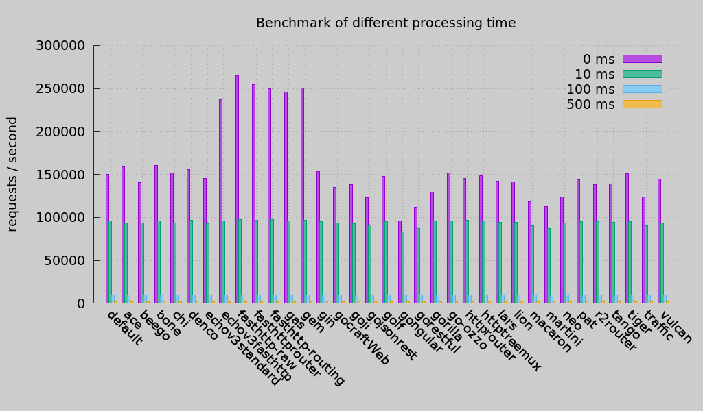

# Gem web framework [](https://github.com/go-gem/gem/wiki) [](https://godoc.org/github.com/go-gem/gem) [](https://travis-ci.org/go-gem/gem) [](https://goreportcard.com/report/github.com/go-gem/gem) [](https://coveralls.io/github/go-gem/gem?branch=master) [](https://gitter.im/go-gem/gem?utm_source=badge&utm_medium=badge&utm_campaign=pr-badge&utm_content=badge)

Gem, a simple and fast web framework written in Go(golang), it built on top of [fasthttp](https://github.com/valyala/fasthttp).

**Note** it is currently not incompatible with `Windows`, see [#8](https://github.com/go-gem/gem/issues/8), apologize for the inconvenience.

Um, Gem is quite new package, so it's APIs is currently unstable until the `v1.0.0` being released,
see [milestones](https://github.com/go-gem/gem/milestones) for details,
and if you are interest in this project, you can star it, all of suggestions and PRs are welcome. 


## Install

```
go get github.com/go-gem/gem
```


## Features

- [Graceful shutdown and restart](https://github.com/go-gem/gem/wiki/Graceful-shutdown-and-restart)
- [Leveled logging](https://github.com/go-gem/gem/wiki/Logger)
    - [Gem log](https://github.com/go-gem/log) - default logger.
    - [logrus](https://github.com/sirupsen/logrus) - structured, pluggable logging package, compatible with Gem.
- [High-performance](#performance) and pretty [router](https://github.com/go-gem/gem/wiki/Router), very friendly to REST APIs
- [Sessions support](https://github.com/go-gem/gem/wiki/Sessions)
- [Various Middlewares](https://github.com/go-gem/gem/wiki/Middleware)
    - [JSON Web Token middleware](https://github.com/go-gem/gem/wiki/JSON-Web-Token-middleware)
    - [Compress middleware](https://github.com/go-gem/gem/wiki/Compress-middleware)
    - [Basic auth middleware](https://github.com/go-gem/gem/wiki/Basic-auth-middleware)
    - [Request body limit middleware](https://github.com/go-gem/gem/wiki/Request-body-limit-middleware)
    - [CSRF middleware](https://github.com/go-gem/gem/wiki/CSRF-middleware)
    - [CORS middleware](https://github.com/go-gem/gem/wiki/CORS-middleware)
    - [Sessions middleware](https://github.com/go-gem/gem/wiki/Sessions-middleware)
- [Not bad scores of test coverage](https://coveralls.io/github/go-gem/gem?branch=master) - 85%～100% is acceptable.


## Performance



| Parameter |                       Info                       |
|:----------|:-------------------------------------------------|
| Date      | 2016-11-01                                       |
| Go Version| 1.7.1                                            |
| OS        | Ubuntu 16.04.1 LTS                               |
| CPU       | Intel(R) Core(TM) i7-4720HQ CPU @ 2.60GHz 8 Cores|
| Memory    | 8G                                               |

The benchmark comes from my laptop, I have sent a pull request to [go-web-framework-benchmark](https://github.com/smallnest/go-web-framework-benchmark),
waiting for rerunning the benchmark.


## Quick Start

More usages may be obtained in [Wiki](#wiki).

```
package main

import (
    "log"
    
    "github.com/go-gem/gem"
)

func main() {
    router := gem.NewRouter()
    router.GET("/", func(ctx *gem.Context) {
        ctx.HTML(200, "Hello world.")
    })

	log.Fatal(gem.ListenAndServe(":8080", router.Handler()))
}
```

Run the code above, and then navigate to [localhost:8080](http://localhost:8080).


## [Examples](https://github.com/go-gem/examples)

Please refer to https://github.com/go-gem/examples


## Semantic Versioning

Gem follows [semantic versioning 2.0.0](http://semver.org/) managed through GitHub releases.


## Support Us

- :star: the project.
- Spread the word.
- [Contribute](#contribute) to the project.


## Contribute

- [Report issues](https://github.com/go-gem/gem/issues/new)
- Send PRs.
- Improve/fix documentation.

**We’re always looking for help, so if you would like to contribute, we’d love to have you!**


## Motivation

Just for figuring out the web framework's workflow, and try to design a simple and strong web framework.


## Related Packages

- [**tests**](https://github.com/go-gem/tests) - a tests package for fasthttp and Gem.
- [**sessions**](https://github.com/go-gem/sessions) - a sessions manager package for fasthttp.
- [**log**](https://github.com/go-gem/log) - a simple, leveled logging package.


## FAQ

1. What should I pay attention to?

    At present, Gem is incompatible with some APIs of fasthttp, the incompatible APIs following:
    
    - **fasthttp.TimeoutHandler**

2. What is the difference between of fasthttp and gem?

    **Gem built on top of fasthttp, and use `Server.ServeConn` to serve connections, it can not works without fasthttp**.
    
    **Advantages**: 
    
    Gem provides some useful built-in features, such as:
    
    - High-performance router
    - Leveled logger
    - Various middlewares
    - Sessions support
    - Graceful shutdown and restart
    
    **Disadvantages**: 
    
    At present, Gem dose not provide APIs to Serve the custom `Listener` like `fasthttp.Serve`.


## LICENSE

MIT licensed. See [LICENSE](LICENSE) file for more information.

**Inspiration & Credits**

I have read the code of the following open source projects, and integrate their designs into this project.

I respect these projects and it's authors, and follow their LICENSE.

If your LICENSE is missing, please contact me, I will add it ASAP.

- [**fasthttp**](https://github.com/valyala/fasthttp) - [LICENSE](https://github.com/valyala/fasthttp/blob/master/LICENSE)
- [**httprouter**](https://github.com/julienschmidt/httprouter) - [LICENSE](https://github.com/julienschmidt/httprouter/blob/master/LICENSE)
- [**fasthttprouter**](https://github.com/buaazp/fasthttprouter) - [LICENSE](https://github.com/buaazp/fasthttprouter/blob/master/LICENSE)
- [**echo**](https://github.com/labstack/echo) - [LICENSE](https://github.com/labstack/echo/blob/master/LICENSE)
- [**endless**](https://github.com/fvbock/endless) - [LICENSE](https://github.com/fvbock/endless/blob/master/LICENSE)
- [**go-graceful-restart-example**](https://github.com/Scalingo/go-graceful-restart-example) - [LICENSE](https://github.com/Scalingo/go-graceful-restart-example/blob/master/LICENSE)